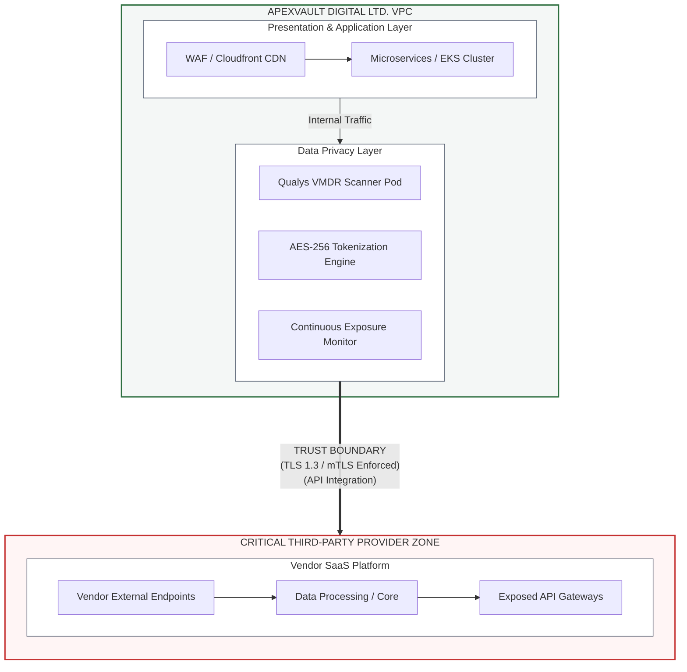

# DORA & GDPR Third-Party Risk Management (TPRM) Framework
## Fictional Corporate Context: ApexVault Digital Ltd.

### 🏢 Executive Overview
ApexVault Digital Ltd. is a fictional high-growth FinTech organization headquartered in the European Union. ApexVault operates a cloud-native peer-to-peer (P2P) B2B payment processing platform. Because ApexVault processes core financial transactions and handles sensitive Personally Identifiable Information (PII) of EU citizens, the organization falls squarely under the regulatory mandates of both the **Digital Operational Resilience Act (DORA)** and the **General Data Protection Regulation (GDPR)**.

To maintain its operational resilience and protect data privacy, ApexVault utilizes an advanced Governance, Risk, and Compliance (GRC) framework engineered by combining industry standard methodologies with specialized domain expertise:
*   **ISO/IEC 27701:2019**: Extension to ISO/IEC 27001 for privacy information management.
*   **Cloud Security Alliance (CSA) CCSK**: Cloud Security Alliance Cloud Controls Matrix (CCM) integration for cloud-native tenant isolation boundaries.
*   **Qualys VMDR (Vulnerability Management, Detection, and Response)**: Lifecycle-based continuous asset discovery, vulnerability prioritization, and patch orchestration SLAs.
*   **Harvard VPAL Risk Management Framework**: Quantitative risk assessment methodologies evaluating inherent threat vector likelihood, operational velocity impacts, and residual risk quantification.

---

### 🏛️ Architecture & Network Boundaries
The diagram below illustrates the strict logical and physical isolation network boundaries maintained between ApexVault's production Virtual Private Cloud (VPC) and Third-Party Infrastructure (SaaS/IaaS/PaaS providers).

text 

